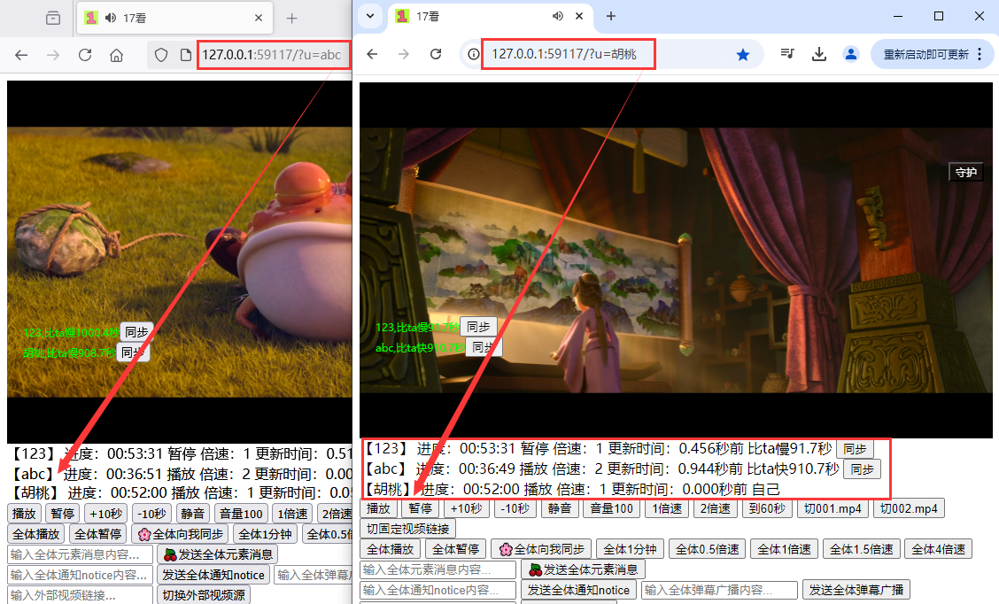
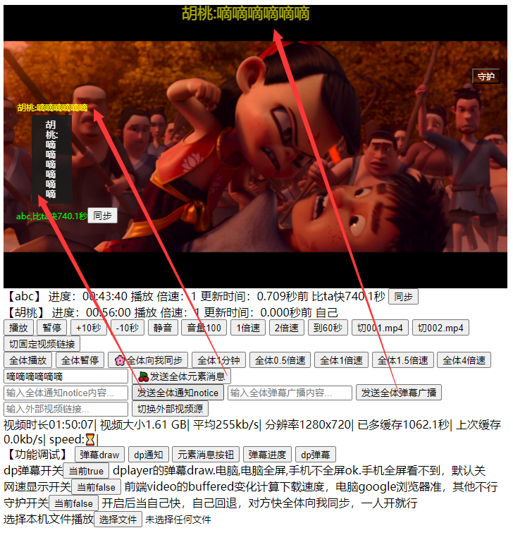
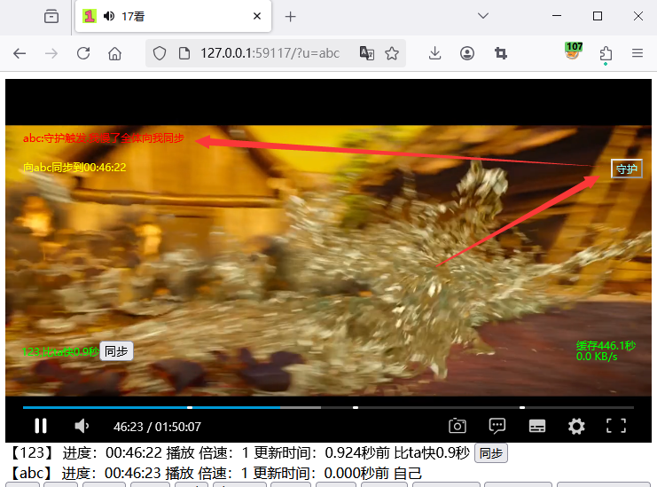
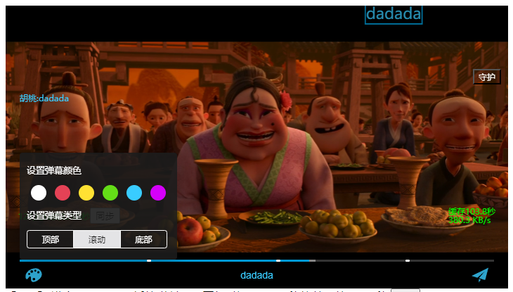

一起看视频，多人同步播放，实现同时观看，异地同屏观看视频，多人同步播放，两人一起看电影
同步看视频，异地同步观影，同步播放进度，可多设备观看同一视频链接，可多人本地视频同步观看

简介：
后端:python3.8,Flask.2.3,Flask-SocketIO5.3.6  
前端:HTML5,javascript,Dplayer(开源的HTML5视频播放器)1.27.0,Socket.IO4.7.4  
自己部署到云服务器上，多设备访问同步看视频  
运行flask99.py后占用59117端口  
访问时传递u参数区分不同用户如本地运行如: http://127.0.0.1:59117/?u=umena  

每秒上报自己播放进度，播放状态，播放倍速，后端保留10秒，可多人  
获取所有人信息，页面下方展示，每个用户一行，详细信息，与ta差距时间，向ta同步按钮  
可以向对方同步，也可以让所有人向我同步  
通过websocket广播做到所以客户端同步操作  
全体暂停，全体向我同步，全体播放，3个基础功实现手动同步，并外置按钮  

外置3种全体实时消息发送按钮和回车发送：发送全体元素消息，dp弹幕，dp通知  
原生弹幕是和播放时间绑定的，改写后发送时全体实时展示
消息方式1：dplayer内置弹幕，原来选用，单手机全屏不行，且视频暂停时看不到，弃用  
消息方式2：dplayer内置通知，展示效果一般，弃用  
消息方式3：用html的新建element元素appendChild加入到视频video元素里，兼容好

全屏播放时，可以看到消息和发送消息，电脑和手机都行  
守护功能：开启后当自己快，自己回退，对方快全体向我同步，一人开就行  
可以调整全体倍速，外置改全体播放速度按钮  
播放视频源可换外部链接  
播放视频源可换本地文件，电脑chromeOK,安卓360极速浏览器OK(可以选择本机视频播放)  

显示视频下载速度，就电脑chrome显示正常  
外置播放视频相关功能按钮：播放暂停，快进10秒，静音，换倍速，进度调整(基础功能)
有人播放卡顿和恢复卡顿时通知全体  
有人进入离开时通知全体  
有人播放暂停时通知全体  
使用js行内样式设置,无css文件  
下方显示视频信息：总时长，总大小，平均每秒kb，分辨率，已缓存秒数，上次缓存网速
访问和全屏播放时在左下角固定显示与其他人的进度差距，和向他同步按钮  
访问和全屏播放时在左上角固定守护按钮，生效黄色，不开启白色，一人开就行  
访问和全屏播放时在左下角固定网速下载速度显示，已缓存秒数显示  
用dplayer进度条提示点，显示固定时间点，30分钟，1小时，1.5小时  
收到的消息在页面上累加保存
后端允许被跨域访问cross-origin  
代码注释很多  
开源协议AGPL-3.0 license全称GNU Affero General Public License, version 3.0  
任何衍生作品必须完全开源（包括闭源分发或网络服务），确保开源生态延续性  
github：【umena337/17kan】  

==================项目目录结构
17kan/  
├── README.md                     # 项目说明  
├── flask99.py                    # 后端直接运行占用端口59117  
├── requirements.txt              # python依赖第三方库列表  
├── static/                       # 子目录  
│     ├── index99.html            # 前端html代码  
│     ├── index99script.js        # 前端html代码用的scripts  
│     ├── 001.mp4                 # 演示视频文件  
│     ├── favicon.ico             # 浏览器小图标  
│     ├── DPlayer.min.css         # 前端用到开源HTML5视频播放器  
│     ├── DPlayer.min.js          # 前端用到开源HTML5视频播放器  
│     ├── socket.io.min.js        # 前端websocket通信用到  
│     ├── socket.io.min.js.map    # 前端websocket通信用到  

使用细节：  
腾讯云最便宜学生云(带宽4Mbps),理论512KB/s  
视频文件大小2G，视频时长2小时，平均291KB/s (所以自己部署视频源卡)  
开发测试浏览器：电脑chrome和火狐，手机360极速浏览器(设置里的视频播放选择网页原生播放器)  
不是所以mp4都能播放，要编码正确：视频H.264/AVC & 音频AAC  不然没画面或者没声音(用格式工厂可以看)  

待增加：  
下方显示视频编码信息  
关于看视频卡顿，从服务端和客户端都没有很好的检测手段  
关于视频网页卡顿，从是media标签默认的分段传输入手，从服务端和客户端入手监控每次分段传输的耗时  
浏览器分段请求视频文件的range 和ifrange  
浏览器通过video标签加载视频时，默认会发起 HTTP Range Requests 分块请求视频数据（如 Range: bytes=0-1023），  
服务端返回部分内容（206 Partial Content）。这种机制支持视频的边加载边播放，但若某次分段传输耗时过长，会导致缓冲不足和卡顿。  
Flask 中默认的处理流式响应（Streaming Response）怎么监控传输速率  
Flask中在static下的视频文件默认的流式分段传输怎么监控每次分段的耗时时间  仅包含读取文件分块和发送到内核缓冲区的时间。  
用外挂字幕：显示固定消息  
重写dplayer里按钮功能：照相截图，发弹幕，字幕开关。设置点开[速度,洗脑循环,显示弹幕,海量弹幕,弹幕透明度]  
